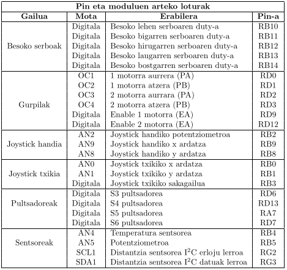

# Yoni-the-robot

## Proiektuaren aurkezpena eta hardwarea

Proiektu honen helburua 5 serboko beso robotiko bat kontrolatzea da PIC mikrokontrolagailu batekin.
Beso hau hainbat modutara kontrolatu beharko da: UART bidez ordenagailuko teklatua erabiliz, eta
joystick eta potentziometroak erabiliz. Proiektua aurrera eramateko modu erraz batean UART-aren bi-
tartez ahalik eta balio gehienak inprimatu beharko dira arazoak baldin badaude errazago aurkitzeko.
Proiektu honekin eskatutako minimoez aparte, hainbat gehigarri jarri ditugu, eta hoien artean hauek
daude: gurpilen bitartezko mugimendua, posizio segurua botoia sakatuz eta distantzia sentsorearekin
mugimenduaren kontrola.

## Hardwarea

Proiektua aurrera eramateko bi joystick, hainbat serbo motor besorako, gurpilak, hainbat sentsore eta
pultsadoreak erabili ditugu. Joystick handiaren y ardatzaren bitartez mugitzen ditugu gurpilak, joystick
berak duen potentziometroaren bitartez besoaren serboetako bat mugitzen dugu. Joystick txikiaren x eta
y ardatzen bitartez bi serbo motor mugitzen ditugu, eta sakagailuaren bitartez posizio seguruaren sistema
aktibatzen dugu. Pultsadoreen bitartez scroll-a eta sarrera mota aukeratzen ditugu. Potentziometroaren
bitartez lehen serboa kontrolatzen dugu eta distantzia sentsoreen bidez robota aurrera mugitu daitekeen
edo ez aukeratzen dugu.
Aurretik komentatutako gailuak plakara konektatzeko, hauek izan dira erabilitako pinak:

 

## Kodearen funtzionamendua

Kodea ahalik eta edagarriena izateko, proiektuak dituen inplementatutako ezaugarriak modu asinkronoan
exekutatuko dira. Guztia asinkronoki inplementatzen badugu ezaugarri guztiak modu isolatuan garatu
ditzakegu. Hau lortzeko, hardware guztia etenen bitartez kudeatu behar dugu.
Kodea guztiz asinkronoa izateak ere arazo batzuk ekartzen ditu, izan ere, kalkulu konplexuak egin behar
badira CPU-a denbora asko galduko da etenak kudeatzen. Hau saihesteko kalkulu konplexu hauek etene-
tatik atera eta begizta nagusian sartuko dira (eta aldagaien bitartez etenen bidez kalkulu hauek kudeatu).
Etenetatik lan karga kentzeko beste modu bat egoera makinak dira. Teknika hau batez ere timer -etako
erabili da, eten batean kalkulu guztiak egin beharrean, kalkuluak zatika egingo dira eten bakoitzeko
egoera bat izanik.

## Implementatutako ezaugarriak

### Hainbat sarrera modu

Proiektuaren betebehar bat beso robotikoa bi moduetara mugitzean datza: UART -aren bitartez eta
Joystick -en bitartez. Bi modu hauek espero den bezala ezin dira aldi berean erabili, eta beraz, sarrera
modua definitu behar da kodean. Hauen aldaketa plakan dagoen S6 sakagailua erabilita egingo da, eten
bat sortuz eta aldaketa eginez.
UART -aren bidezko mugimenduak nahiko errazak izan dira inplementatzeko, izan ere, sakatua dagoen
bitartean duty-ari konstante bat batu/kentzearekin nahikoa da. Baina joystick-en bidezko sarrera kon-
plexuagoa da, izan ere, balioak 0 eta 1023 artekoak dira. Balio hoiek eskalatu egin behar dira (−20, 20)
tartean egoteko, eta hori ondorengo formularekin egiten da: v = x−515
20 . Hau aplikatzen badugu joystick-
etako sentsibilitatea ez da galduko, eta beraz, joystick-a gutxi mugitzen badugu robota ere pixkanaka
pixkanaka mugituko da.
Joystick-ez gain, potentziometroak ere erabili ditugu hainbat serbo kontrolatzeko, eta hauek ere trata-
mendu berezi bat behar dute. Normalean egiten dena da potentziometroaren balioa zuzenean duty-an
sartu, baina honekin mugimendu azkarregiak egin daitezke, besoaren zatiak austeko posibilitatearekin.
Hau konpontzeko, mugimenduak suabizatzeko algoritmo bat aplikatzen da non serboak zein norabide
hartu behar duen ikusten den eta mugimendu hau poliki poliki aplikatzen den.

### Posizio segurua botoi bat sakatzean

Arriskutsua izan daiteke korrontea kentzea, izan ere, motor guztiek egin dezaketen indarra galtzen da
eta beso osoa erori daiteke. Hau konpontzeko posizio segururako sistema bat aplikatzen da botoi bat
sakatzean. Hau sistema handiago baten parte da.
Sistema hau helburu posizio sistema da, sistema honen bitartez sarrera guztiak desgaitzen dira eta eman-
dako posiziora mugitzen ditu poliki poliki serbo guztiak. Momentu honetan sistema hau ez da erabiltzen
beste tokietan, baina modu oso errazean zabaldu daiteke posizio batetik bestera mugitzeko egoera makina
batekin, animazioak sortuz.
Sistema honek hasiera batean sarrera guztiak blokeatzen ditu, transizioan interferentziarik ez egoteko,
eta serboak mugitzen ditu poliki poliki posiziora iritsi arte; ondoren sarrera automatikoki UART moduan
jarriko da, potentziometroarekin arazorik ez egoteko.

### LCD.aren scroll-a

Hasiera batean datu gutxi zeudenez, datuak oso modu errazean pantailaratu zaitezkeen, baina proiektu
honetan joystick eta motor guztien datuak pantailaratu behar direnez, ez dira kabitzen. Nahiz eta UART
bidez pantailaratu datu hauek, ordenagailu bat konektaturik ez badago ere ikusi nahi genituenez balioak
LCD-an scroll -a inplementatzea pentsatu genuen.

UART-ak momentu honetan 23 lerro inprimatzen ditu, eta lerro hauek guztiak ere inprimatu nahi geni-
tuen. Horretarako scroll -a inplementatu genuen. LCD-an agertzen diren lerroak indize batekin kontro-
latzen dira eta indize hau plakako bi sakagailurekin kontrolatzen da (S4 eta S5 ).

### Gurpilen bitartezko mugimendua

Gurpilen bitartezko mugimenduak hasiera batean beste serboekin egiten dugun mekanika berdina aplika
dezakegula, baina hau ez da honela. Besoan erabili ditugun motorrek mugak dituzte izan ditzaketen an-
geluetan. Espero den bezala, robota mugitu nahi badugu, gurpilek nahi bezain beste biratu beharko luke.
Horretan laguntzeko kontrolagailu txiki bat erabiltzen dugu. Kontrolagailu hau aurreko serboak bezala
erabiltzen ditugu, baina horaingo honetan duty-ak motorraren posizioa eman beharrean honen abiadura
emango du. Kasu honetan, motorra aurrera joatea nahi badugu duty-aren seinalea irteera batetik bidali
beharko dugu, eta atzera joatea nahiko bagenu beste batetik; motor bakoitzeko bi pin erabiliz.
Hau jakinda, joystick-etik datozten balioak eraldatu beharko ditugu (aurreko ezaugarrian egiten den
moduan), baina balioak bi zatitan banatuta: aurrera mugitzeko abiadura eta atzera mugitzeko abiadura.
Horaingo honetan abiadura **v = |(x-515)/20|** bezala kalkulatuko da eta beharrezkoa den pin-a aukeratuko da.

### Distantzia sentsorea

Distantzia sentsorea robotak mugitu behar duen ala ez jakiteko erabiltzen da, distantzia txikiegia bada
horma aurrean duela esan nahi du eta beraz mugitzea egokiena ez dela. Ezaugarri hau aurreko ezauga-
rriarekin oso lotuta dago.
Distantzia sentsore hau I 2 C busaren bitartez konektatzen da, eta LED baten bitartez erakusten da buseko
helbidea. Behin hau jakinda, sentsorearen erregistroak irakurri/idazten dira distantziak lortzeko.
